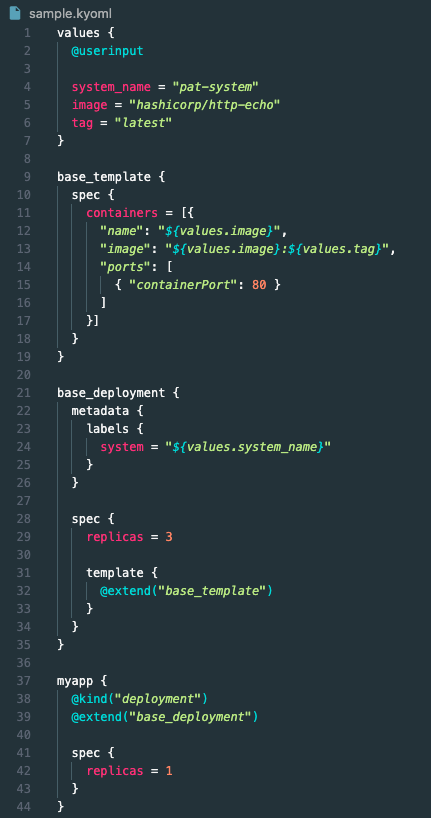

# Kyonetes

[](https://forthebadge.com)
[](https://forthebadge.com)

> **WARNING: Experimental - Do not use for realz**

## Concept

This is an attempt at using [KyoML](https://kyoml.com) to generate Kubernetes manifests.
KyoML is a dynamic markup language with support for custom directives and plugins.

Through the use of custom `@directives`, this will generate a K8s compatible yaml file

Here's a sample kyoml deployment file



## How to test it out

### Install dependencies

```bash
$ npm install
```

### Run the generation script

```bash
$ npm run dev -- [arguments]
```

Rendering a KyoML file into a K8s YAML:

```bash
$ npm run dev -- template ./sample.kyoml

apiVersion: apps/v1
kind: Deployment
metadata:
  name: myapp
spec:
  replicas: 1
  template:
    spec:
      containers:
        - name: hashicorp/http-echo
          image: hashicorp/http-echo:latest
          ports:
            - containerPort: 80
```

Overriding values

```bash
$ npm run dev -- template ./sample.kyoml --image=myrepo/myimage

apiVersion: apps/v1
kind: Deployment
metadata:
  name: myapp
spec:
  replicas: 1
  template:
    spec:
      containers:
        - name: myrepo/myimage
          image: myrepo/myimage:latest
          ports:
            - containerPort: 80
```
